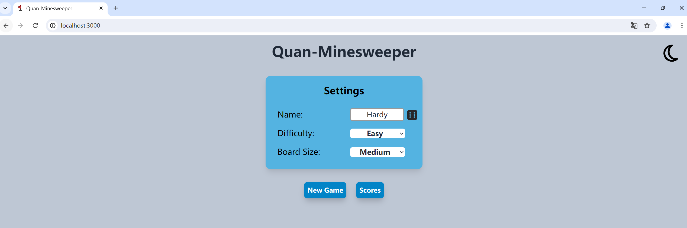
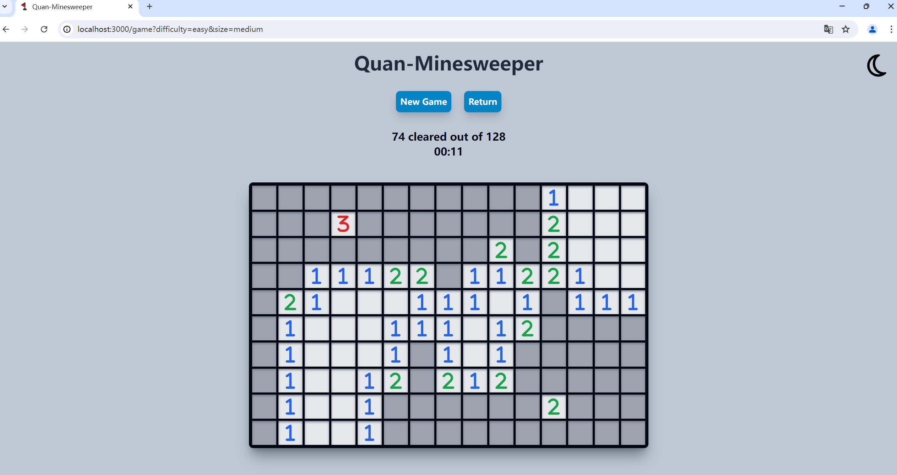
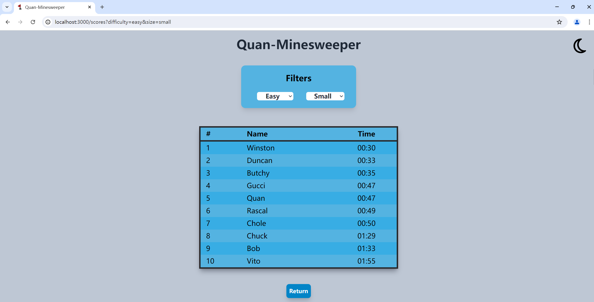

# Quan-Minesweeper

## 项目介绍
Quan-Minesweeper 是一个使用 `leptos` 和 `axum` 框架实现的扫雷 Web 应用程序, 运行本项目需要使用到 leptos 相关工具. 

项目实现了扫雷游戏的基本功能, 设置了三种难度——easy normal hard, 设置了三种扫雷界面大小——small medium large. 并且使用 SQLite 数据库存储游戏排行榜, 显示各种模式下获胜玩家的用户名和用时. 此外, 项目还支持网页的深色模式/浅色模式切换.

> leptos 是一个用于构建 Web 应用程序的 Rust 框架，它结合了服务器端渲染 (SSR) 和客户端渲染 (CSR) 的优势。

> axum 是一个基于 tokio 和 hyper 的 Rust Web 框架，它提供了简洁的 API 和强大的路由系统。通过结合 leptos 和 axum，开发者可以轻松地构建出高性能的 Web 应用程序。

- 本项目的 Web 服务器使用 Axum 框架处理 HTTP 请求, 并结合了 Leptos 框架进行前端渲染.

- 本项目是使用 Leptos 提供的[模板](https://github.com/leptos-rs/start-axum)创建的.

Scoreboard data is tracked using sqlite, with the database file path specified in a .env file containing a DATABASE_URL environment variable. Once a file is created and DATABASE_URL is assigned, sqlx migrations will recreate the database.

排行榜 (Scoreboard) 的数据存储使用 SQLite 数据库, 并且在包含 `DATABASE_URL` 环境变量的 .env 文件中指定了数据库文件路径. 项目中包含了 sqlx 迁移的代码, 一旦创建了一个 .env 文件并分配了 `DATABASE_URL`, 并且在项目根目录下运行命令`sqlx migrate run`, 系统将根据设定好的迁移脚本重新创建数据库表和结构, 以确保数据库结构与应用程序代码保持同步.
## 项目结构
- 根目录文件
    - Cargo.toml: 项目的配置文件, 定义了项目的依赖项、元数据和构建信息
    - .gitignore: 定义了应忽略的文件和目录, 通常用于版本控制忽略不必要的文件
    - README.md: 项目的自述文件, 包含项目介绍、安装和运行说明
    - rust-toolchain.toml: 指定了项目使用的 Rust 工具链版本
    - tailwind.config.js: Tailwind CSS 的配置文件
    - names.json: 包含随机生成用户名的 JSON 文件
- 目录
    - migrations/: 包含数据库迁移文件, 用于初始化和更新数据库表结构
    - public/: 静态文件目录，包含公开访问的资源
    - src/: 项目的源代码目录
    - main.rs: 项目的入口文件，包含主函数和主要逻辑
    - app.rs: 定义了应用程序的核心组件和路由
    - game_logic.rs: 包含游戏的主要逻辑实现
    - game_settings.rs: 包含游戏设置的相关代码
    - pages/: 包含不同页面的组件
    - utils.rs: 包含一些工具函数
    - style/: 包含样式文件
    - svgs/: 包含 SVG 图标文件
    - images.assets：存放 README 中的图片资源
## 项目启动
- 安装 Rust 的夜间构建版本
    - `rustup toolchain install nightly`
    - 切换到夜间版本: `rustup default nightly`
    - 可用命令 `rustc --version` 查看是否切换成功
- 添加 WebAssembly (WASM) 目标, 以便将 Rust 代码编译成 WebAssembly 格式
    - `rustup target add wasm32-unknown-unknown`
- 安装 Tailwind CSS (用于构建 GUI)
    - `npm install -D tailwindcss`
- 安装 sqlx-cli
    - `cargo install sqlx-cli`
- 安装 leptos
    - `cargo install cargo-leptos`
- 在项目根目录下创建 .env 文件并分配 `DATABASE_URL`
    - 前提: 该数据库路径下已存在 sqlite 数据库文件, 若不存在, 则需要先创建 sqlite 文件, 指令如下:
        - `sqlite3 "DATABASE_URL"` (参数为期望创建的数据库文件的路径)
- 运行迁移脚本
    - `sqlx migrate run`
- 项目运行
    - `cargo leptos watch`
- 在浏览器中打开网页: http://127.0.0.1:3000 或者 localhost:3000
- 进行游戏
## 运行效果
- 主页面

- 游戏界面

- 排行榜
